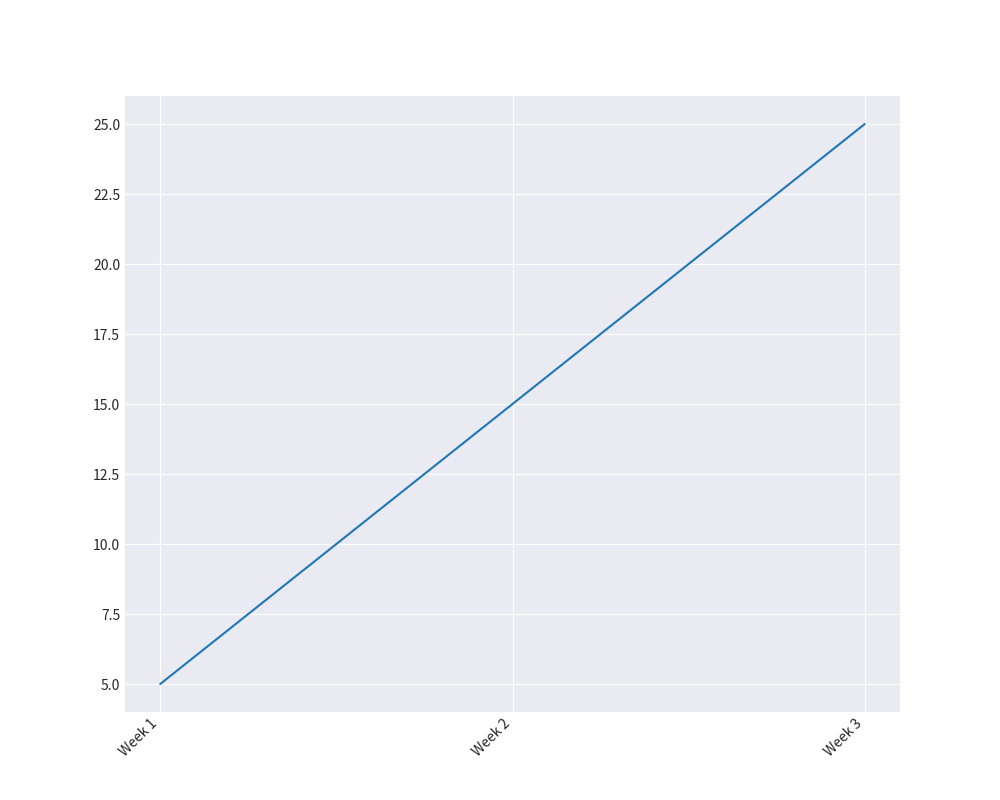
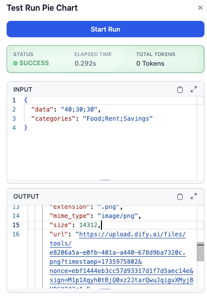
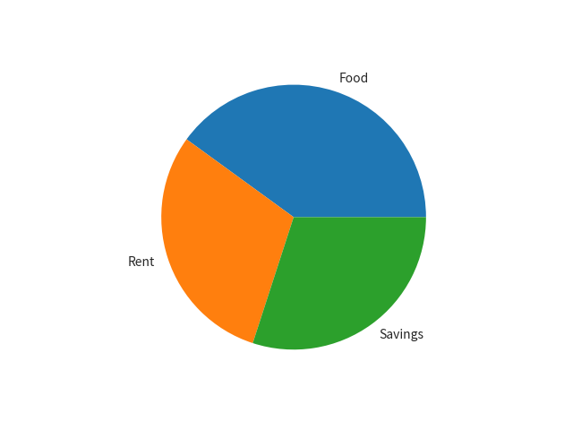

## Overview

The **ChartGenerator** plugin in Dify provides an easy way to generate visual data representations such as bar charts, linear charts, and pie charts. This plugin simplifies the process of creating charts by allowing users to input data and corresponding labels, making it ideal for workflows that require data visualization for analysis or reporting.​

## Configure

## 1. Install the Plugin

1. Go to the **Dify Marketplace**.

2. Search for the **ChartGenerator Plugin**.​

3. Click "Install" to add the plugin to your workspace.

## 2. Tools Included in the Plugin

The ChartGenerator plugin includes three tools:

### Bar Chart​

  - `data` (String, Required): Numerical values for generating the chart, separated by semicolons (;). Example: 10;20;30.
  - `X Axis` (String): Labels for the X-axis, separated by semicolons (;). Example: `Jan;Feb;Mar`.

### Linear Chart

  - `data` (String, Required): Numerical values for generating the chart, separated by semicolons (;). Example: 5;15;25.
  - `X Axis` (String): Labels for the X-axis, separated by semicolons (;). Example: `Week 1;Week 2;Week 3`.

### Pie Chart​

 - `data` (String, Required): Numerical values representing proportions, separated by semicolons (;). Example: `40;30;30`.
  - `Categories` (String, Required): Categories corresponding to each data point, separated by semicolons (;). Example: `Food;Rent;Savings`.

